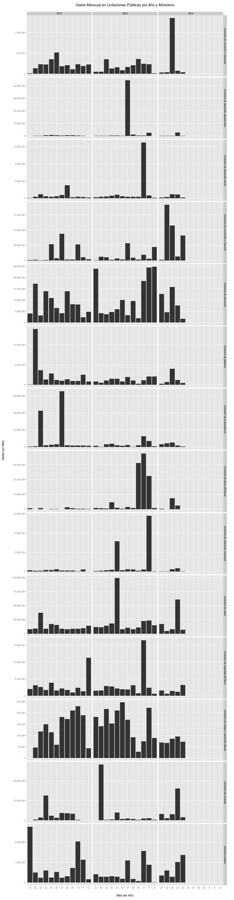

# Gasto Mensual de Licitaciones Publicas en Panamá
Utilizando la data de panadata.net se puede hacer un analisis del gasto mensual por año en licitaciones publicas.


## Cargar archivo y procesar data

```r
library(ggplot2)
library(scales)
library(grid)
library(reshape2)
df <- read.csv("data.csv", sep = "\t")
df$date <- as.Date(df$fecha, "%Y-%m-%d %H:%M:%s")
df$year <- format(df$date, "%y")
df$mon <- format(df$date, "%m")

# Aggregar data y sumar precios
df_melt <- melt(df, id = c("date", "year", "mon", "entidad", "dependencia", 
    "provincia", "objeto", "proponente", "modalidad", "compra_type", "fecha", 
    "acto", "nombre_contacto", "telefono_contacto", "correo_contacto", "unidad"))
df_melt$year = as.factor(df_melt$year)
precios <- df_melt[as.character(df_melt$variable) == "precio", ]
precios$value <- as.numeric(precios$value)
gasto_mensual <- dcast(precios[precios$variable == "precio", ], year + mon ~ 
    variable, sum)

ministerios <- df_melt[grep("Minister|MINISTER", df_melt$entidad), ]
ministerios_precio <- ministerios[as.character(ministerios$variable) == "precio", 
    ]
gasto_ministerios <- dcast(ministerios_precio[ministerios_precio$variable == 
    "precio", ], year + mon + entidad ~ variable, sum)
```


## Resultados Generales

```r
qplot(mon, precio, data = na.omit(gasto_mensual), geom = "bar", facets = . ~ 
    year, stat = "identity") + ggtitle("Gasto Mensual en Licitaciones Publicas por Año") + 
    scale_y_continuous(name = "Gasto por Mes", labels = comma) + scale_x_discrete(name = "Mes del Año") + 
    theme(axis.title.x = element_text(vjust = -2)) + theme(axis.title.y = element_text(angle = 90, 
    vjust = -0.5)) + theme(plot.title = element_text(size = 15, vjust = 3)) + 
    theme(plot.margin = unit(c(1, 1, 1, 1), "cm"))
```

 

## Resultados por Ministerio

```r
qplot(mon, precio, data = na.omit(gasto_ministerios), geom = "bar", facets = entidad ~ 
    year, stat = "identity") + ggtitle("Gasto Mensual en Licitaciones Publicas por Año y Ministerio") + 
    scale_y_continuous(name = "Gasto por Mes", labels = comma) + scale_x_discrete(name = "Mes del Año") + 
    facet_grid(entidad ~ year, scales = "free_y") + theme(axis.title.x = element_text(vjust = -2)) + 
    theme(axis.title.y = element_text(angle = 90, vjust = -0.5)) + theme(plot.title = element_text(size = 15, 
    vjust = 3)) + theme(plot.margin = unit(c(1, 1, 1, 1), "cm"))
```

 

