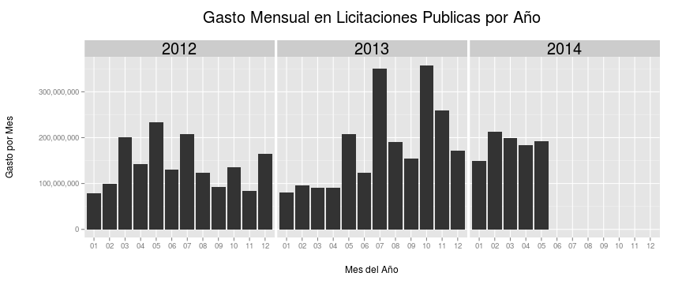
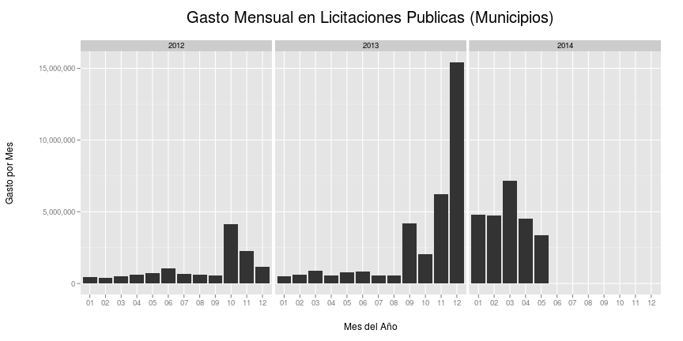
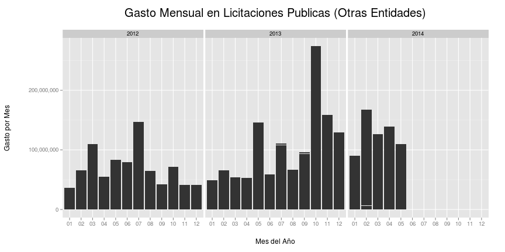

# Gasto Mensual de Licitaciones Publicas en Panamá
Este proyecto se ha dedicado a extraer data de la pagina [www.panamacompra.gob.pa](http://www.panamacompra.gob.pa) desde abril 2013.
La data se almacena en [panadata.net](http://panadata.net). Este sitio cuenta con una herramienta de busqueda.

Los datos y graficas de este analisis fueron confeccionados con [la data en formato csv](http://static.panadata.net/licitaciones.csv) de panadata.net
Solo se cuenta con la data del 2012, 2013 y 2014. Ya que antes de esto el gobierno usaba otro sistema.

## Cargar archivo y procesar data

```r
library(ggplot2)
library(scales)
library(grid)
library(reshape2)
library(RCurl)
library(gridExtra)
options(scipen = 100, digits = 4)

# data de panadata.net
data <- getURL("http://static.panadata.net/licitaciones.csv")
# data <- getURL('http://localhost/licitaciones.csv')

# leer y procesar
df <- read.csv(text = data, sep = "\t", fileEncoding = "latin1")
df$date <- as.Date(df$fecha, "%Y-%m-%d %H:%M:%s")
df$year <- format(df$date, "%Y")
df$mon <- format(df$date, "%m")

# reshape
df_melt <- melt(df, id = c("year", "mon", "entidad", "proponente", "compra_type"))

# subset precios
precios <- df_melt[df_melt$variable == "precio", ]
precios$value <- as.numeric(precios$value)
```


## Licitaciones por Mes
La siguiente grafica muestra la cantidad de licitaciones por mes en cada año.

 


## Gasto por Mes
Para calcular el gasto total por mes y año hay que agregar la data.

```r
# Aggregar data por mes y año y sumar precios
gasto_mensual <- dcast(precios, year + mon ~ variable, sum)
```


Esta grafica muestra el precio sumado de las licitaciones por mes en cada año.
 


## Entidades
Calcular cuanto dinero ha licitado cada entidad gubernamental y mostrar los top 25.

```r
e <- dcast(precios, entidad ~ variable, sum)
grid.table(head(e[with(e, order(precio, decreasing=TRUE)),c(1,2)],25),row.names = FALSE)
```

 


Agregar y dividir por tipo de entidad

```r
# Agregar data por mes, año y entidad y sumar precios
gasto_entidades <- dcast(precios, year + mon + entidad ~ variable, sum)

# crear subsets por ministerio, autoridad, muncipio y otros.
ministerios <- gasto_entidades[grep("minist", gasto_entidades$entidad), ]
autoridades <- gasto_entidades[grep("autor", gasto_entidades$entidad), ]
municipios <- gasto_entidades[grep("munic", gasto_entidades$entidad), ]
universidades <- gasto_entidades[grep("univ", gasto_entidades$entidad), ]
institutos <- gasto_entidades[grep("instit", gasto_entidades$entidad), ]
otros <- gasto_entidades[grep("munic|minist|autor|univ|instit", gasto_entidades$entidad), 
    ]
```


### Resultados por Ministerio
 


### Resultados por Autoridades Gubernamentales
 


### Resultados por Municipios
Por algun motivo desconocido existe una tendencia en los municipios de gastar la mayoria de su presupuesto entre los meses de Septiembre 2013 y Mayo 2014.
A continuacion un desglose por Municipio:

 


### Resultados por Institutos 

 


### Resultados por Universidades 

 

### Resultados por Otros Tipos de Entidades

 


## Proponentes
Calcular cuanto dinero ha recibido cada proponente y mostrar los top 25.
El espacio en blanco pertenece a las licitaciones en las cuales no se ha reportado un proponente seleccionado.

```r
p <- dcast(precios, proponente ~ variable, sum)
grid.table(head(p[with(p, order(precio, decreasing=TRUE)),c(1,2)],25),row.names = FALSE)
```

 


## Licitaciones por Top 10 Proponentes
Para generar estas graficas hay que calcular la frecuencia de los proponentes y escoger los 5 mas frecuentes.


```r
top_proponentes <- names(sort(table(df[df$proponente != "",]$proponente), decreasing=TRUE)[0:5]) #top 5
t_prop <- df[df$proponente %in% top_proponentes,]
#agregar y sumar
proponente_precio <- precios[precios$proponente %in% top_proponentes,]
df_proponentes <- dcast(proponente_precio, year + mon + proponente ~ variable, sum)
```


La grafica muestra la cantidad de licictaciones por mes y proponente.

 


