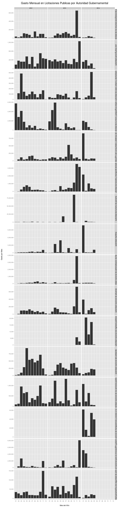

# Gasto Mensual de Licitaciones Publicas en Panamá
Utilizando la data de panadata.net se puede hacer un analisis del gasto mensual por año en licitaciones publicas.
Solo se cuenta con la data del 2012, 2013 y 2014.

## Cargar archivo y procesar data

```r
library(ggplot2)
library(scales)
library(grid)
library(reshape2)
library(RCurl)

# data de panadata.net data <-
# getURL('http://static.panadata.net/licitaciones.csv')
data <- getURL("http://localhost/licitaciones.csv")

# leer y procesar
df <- read.csv(text = data, sep = "\t", fileEncoding = "UTF-8")
df$date <- as.Date(df$fecha, "%Y-%m-%d %H:%M:%s")
df$year <- format(df$date, "%Y")
df$mon <- format(df$date, "%m")
df_melt <- melt(df, id = c("year", "mon", "entidad", "proponente", "compra_type"))
precios <- df_melt[df_melt$variable == "precio", ]
precios$value <- as.numeric(precios$value)

# Aggregar data y sumar precios
gasto_mensual <- dcast(precios, year + mon ~ variable, sum)
gasto_entidades <- dcast(precios, year + mon + entidad ~ variable, sum)

# subsets
ministerios <- gasto_entidades[grep("minist", gasto_entidades$entidad), ]
autoridades <- gasto_entidades[grep("autor", gasto_entidades$entidad), ]
municipios <- gasto_entidades[grep("munic", gasto_entidades$entidad), ]
otros <- gasto_entidades[grep("munic|minist|autor", gasto_entidades$entidad, 
    invert = TRUE), ]
```


## Licitaciones por Mes
La siguiente grafica muestra la cantidad de licitaciones por mes en cada año.

```r
qplot(mon,data=df[!is.na(df$year),],facets=.~year) +
    ggtitle("Cantidad de licitaciones por Mes") +    
    scale_y_continuous(name="Licitaciones por Mes", labels = comma) +    
    scale_x_discrete(name="Mes del Año") +    
    theme(axis.title.x=element_text(size=18, vjust=-2)) +    
    theme(axis.title.y=element_text(size=18, angle=90, vjust=-0.5)) +    
    theme(plot.title=element_text(size=20, vjust=3)) +    
    theme(strip.text.x = element_text(size = 20)) +
    theme(plot.margin = unit(c(1,1,1,1), "cm"))
```

 

## Gasto por Mes

```r
qplot(mon,precio,data=na.omit(gasto_mensual), geom='bar',facets=.~year, stat="identity") +  
    ggtitle("Gasto Mensual en Licitaciones Publicas por Año") +    
    scale_y_continuous(name="Gasto por Mes", labels = comma) +    
    scale_x_discrete(name="Mes del Año") +    
    theme(axis.title.x=element_text(vjust=-2)) +    
    theme(axis.title.y=element_text(angle=90, vjust=-0.5)) +    
    theme(plot.title=element_text(size=20, vjust=3)) +    
    theme(strip.text.x = element_text(size = 20)) +
    theme(plot.margin = unit(c(1,1,1,1), "cm"))
```

 

## Licitaciones por Top 10 Proponentes

Para generar estas graficas hay que calcular la frecuencia de los proponentes y escoger los 10 mas frecuentes.
La primera grafica muestra la cantidad de licictaciones por mes y proponente.
La segundo grafica muestra la suma del precio de cada licitacion por mes y proponente.


```r
top_proponentes <- names(sort(table(df[df$proponente != "",]$proponente), decreasing=TRUE)[0:10]) #top 10
t_prop <- df[df$proponente %in% top_proponentes,]
#agregar y sumar
proponente_precio <- precios[precios$proponente %in% top_proponentes,]
df_proponentes <- dcast(proponente_precio, year + mon + proponente ~ variable, sum)
```


```r
qplot(mon,data=t_prop[!is.na(t_prop$year),],facets=proponente~year) +  
    ggtitle("Cantidad de Licitaciones de los Top 10 Proponentes") +
    scale_y_continuous(name="Gasto por Mes", labels = comma) +    
    scale_x_discrete(name="Mes del Año") +    
    facet_grid(proponente~year, scales='free_y') + 
    theme(axis.title.x=element_text(size=18, vjust=-2)) +    
    theme(axis.title.y=element_text(size=18, angle=90, vjust=-0.5)) +    
    theme(plot.title=element_text(size=20, vjust=3)) +    
    theme(strip.text.y = element_text(size = 20, angle = 90)) +
    theme(plot.margin = unit(c(1,1,1,1), "cm"))
```

 


```r
qplot(mon,precio,data=na.omit(df_proponentes), geom='bar',stat="identity") +  
    ggtitle("Gasto Mensual de los Top 10 Proponentes") +
    scale_y_continuous(name="Gasto por Mes", labels = comma) +    
    scale_x_discrete(name="Mes del Año") +    
    facet_grid(proponente~year, scales='free_y') + 
    theme(axis.title.x=element_text(vjust=-2)) +    
    theme(axis.title.y=element_text(angle=90, vjust=-0.5)) +    
    theme(plot.title=element_text(size=20, vjust=3)) +    
    theme(strip.text.y = element_text(size = 20, angle = 90)) +
    theme(plot.margin = unit(c(1,1,1,1), "cm"))
```

 


## Resultados por Ministerio

```r
qplot(mon,precio,data=na.omit(ministerios), geom='bar',facets=.~year, stat="identity") +  
    ggtitle("Gasto Mensual en Licitaciones Publicas por Año y Ministerio") +    
    scale_y_continuous(name="Gasto por Mes", labels = comma) +    
    scale_x_discrete(name="Mes del Año") +    
    facet_grid(~year, scales='free_y') + 
    theme(axis.title.x=element_text(vjust=-2)) +    
    theme(axis.title.y=element_text(angle=90, vjust=-0.5)) +    
    theme(plot.title=element_text(size=20, vjust=3)) +    
    theme(strip.text.x = element_text(size = 20)) +
    theme(plot.margin = unit(c(1,1,1,1), "cm"))
```

 


A continuacion un desglose por Ministrerio:

```r
qplot(mon,precio,data=na.omit(ministerios), geom='bar',facets=entidad~year, stat="identity") +  
    ggtitle("Gasto Mensual en Licitaciones Publicas por Año y Ministerio") +    
    scale_y_continuous(name="Gasto por Mes", labels = comma) +    
    scale_x_discrete(name="Mes del Año") +    
    facet_grid(entidad~year, scales='free_y') + 
    theme(axis.title.x=element_text(vjust=-2)) +    
    theme(axis.title.y=element_text(angle=90, vjust=-0.5)) +    
    theme(plot.title=element_text(size=20, vjust=3)) +    
    theme(strip.text.y = element_text(size = 12, angle = 90)) +
    theme(plot.margin = unit(c(1,1,1,1), "cm"))
```

 


## Resultados por Autoridades

```r
qplot(mon,precio,data=na.omit(autoridades), geom='bar',facets=.~year, stat="identity") +  
    ggtitle("Gasto Mensual en Licitaciones Publicas (Autoridades Gubernamentales)") +    
    scale_y_continuous(name="Gasto por Mes", labels = comma) +    
    scale_x_discrete(name="Mes del Año") +    
    facet_grid(entidad~year, scales='free_y') + 
    theme(axis.title.x=element_text(vjust=-2)) +    
    theme(axis.title.y=element_text(angle=90, vjust=-0.5)) +    
    theme(plot.title=element_text(size=20, vjust=3)) +    
    theme(plot.margin = unit(c(1,1,1,1), "cm"))
```

 


```r
qplot(mon,precio,data=na.omit(autoridades), geom='bar',facets=entidad~year, stat="identity") +  
    ggtitle("Gasto Mensual en Licitaciones Publicas por Autoridad Gubernamental") +    
    scale_y_continuous(name="Gasto por Mes", labels = comma) +    
    scale_x_discrete(name="Mes del Año") +    
    facet_grid(entidad~year, scales='free_y') + 
    theme(axis.title.x=element_text(vjust=-2)) +    
    theme(axis.title.y=element_text(angle=90, vjust=-0.5)) +    
    theme(plot.title=element_text(size=20, vjust=3)) +    
    theme(strip.text.y = element_text(size = 12, angle = 90)) +
    theme(plot.margin = unit(c(1,1,1,1), "cm"))
```

 


## Resultados por Municipios

```r
qplot(mon,precio,data=na.omit(municipios), geom='bar',facets=.~year, stat="identity") +  
    ggtitle("Gasto Mensual en Licitaciones Publicas (Municipios)") +    
    scale_y_continuous(name="Gasto por Mes", labels = comma) +    
    scale_x_discrete(name="Mes del Año") +    
    facet_grid(.~year, scales='free_y') + 
    theme(axis.title.x=element_text(vjust=-2)) +    
    theme(axis.title.y=element_text(angle=90, vjust=-0.5)) +    
    theme(plot.title=element_text(size=20, vjust=3)) +    
    theme(strip.text.y = element_text(size = 20, angle = 90)) +
    theme(plot.margin = unit(c(1,1,1,1), "cm"))
```

 

Por algun motivo desconocido existe una tendencia en los municipios de gastar la mayoria de su presupuesto entre los meses de Septiembre 2013 y Mayo 2014.
A continuacion un desglose por Municipio:


```r

qplot(mon,precio,data=na.omit(municipios), geom='bar',facets=entidad~year, stat="identity") +  
    ggtitle("Gasto Mensual en Licitaciones Publicas por Municipio") +    
    scale_y_continuous(name="Gasto por Mes", labels = comma) +    
    scale_x_discrete(name="Mes del Año") +    
    facet_grid(entidad~year, scales='free_y') + 
    theme(axis.title.x=element_text(vjust=-2)) +    
    theme(axis.title.y=element_text(angle=90, vjust=-0.5)) +    
    theme(plot.title=element_text(size=20, vjust=3)) +    
    theme(strip.text.y = element_text(size = 12, angle = 90)) +
    theme(plot.margin = unit(c(1,1,1,1), "cm"))
```

 


## Resultados por Otras Entidades

```r
qplot(mon,precio,data=na.omit(otros), geom='bar',facets=entidad~year, stat="identity") +  
    ggtitle("Gasto Mensual en Licitaciones Publicas (Otras Entidades)") +    
    scale_y_continuous(name="Gasto por Mes", labels = comma) +    
    scale_x_discrete(name="Mes del Año") +    
    facet_grid(entidad~year, scales='free_y') + 
    theme(axis.title.x=element_text(vjust=-2)) +    
    theme(axis.title.y=element_text(angle=90, vjust=-0.5)) +    
    theme(plot.title=element_text(size=20, vjust=3)) +    
    theme(strip.text.y = element_text(size = 12, angle = 90)) +
    theme(plot.margin = unit(c(1,1,1,1), "cm"))
```

 


